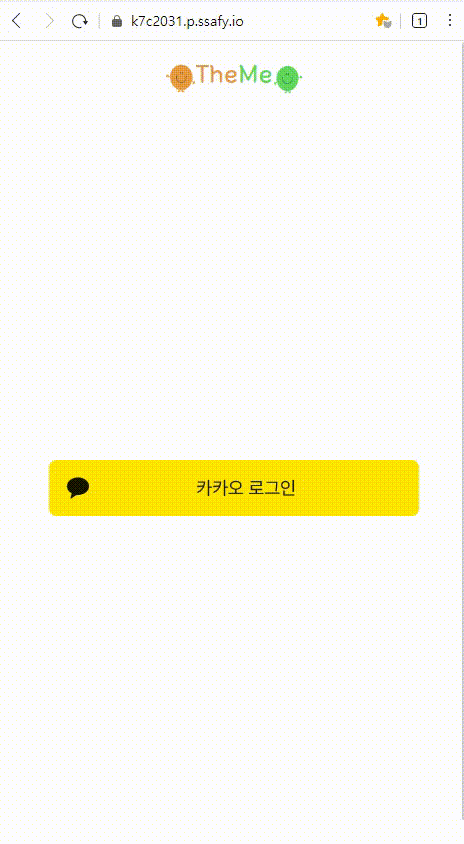
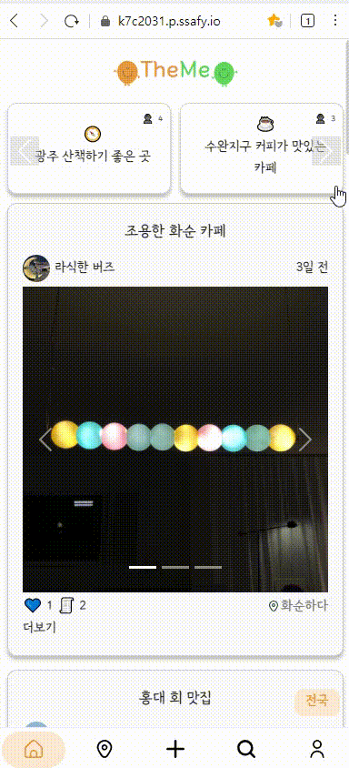
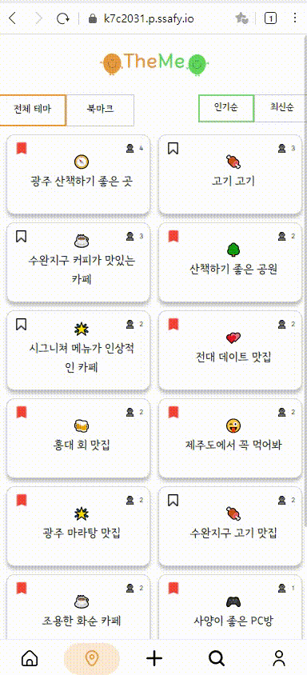
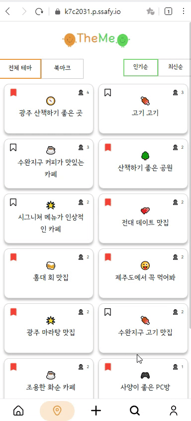
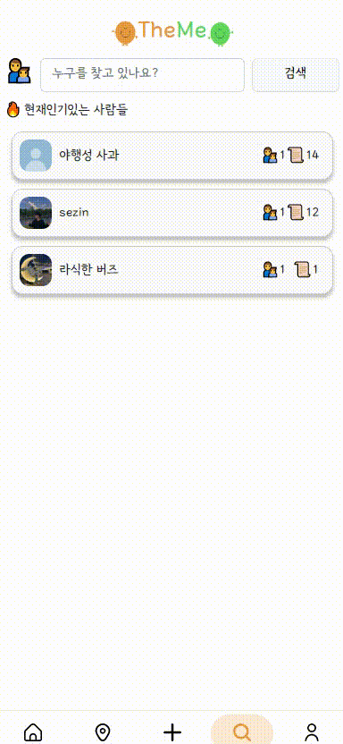
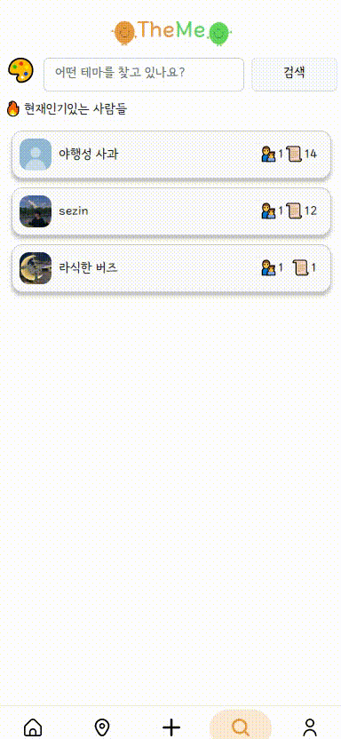
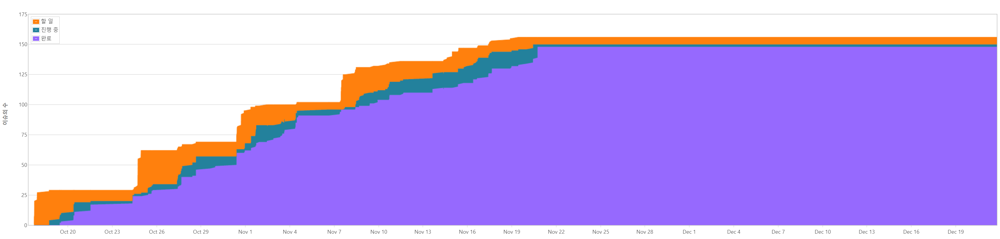

# TheMe
<div align="center">
<br />
    
    <h3></h3>
    <h3> 장소 기반 취향을 공유하는 SNS </h3>
    <p align="center">
<br />
</div>

## 🎈팀원 소개

```
삼성 청년 SW 7기 광주 2반 자율 프로젝트 C203 - F1B4
```

|             [이재민](https://github.com/ljm0850)             |            [김세진](https://github.com/kimsezin)             |                [김유완](https://github.com/)                 |             [김지호](https://github.com/ammajoe)             |             [최강](https://github.com/lion1735)              |
| :----------------------------------------------------------: | :----------------------------------------------------------: | :----------------------------------------------------------: | :----------------------------------------------------------: | :----------------------------------------------------------: |
|  |  |  |  |  |
|                           팀장, FE                           |                            BE, FE                            |                            BE, FE                            |                            BE, FE                            |                            BE, FE                            |

<br />
<br />

## 1. 프로젝트 소개

- TheMe는 테마를 주제로 이에 적합한 장소를 공유하며 모두가 만들어 가는 SNS 입니다.
- 개인이 테마를 만들어 작성하고, 이런 개인 테마가 모여 공통 테마가 만들어 집니다.
- 특정 인물이 작성한 테마(개인 테마)를 팔로우 하여 새로운 글 작성시 메인 화면에서 확인할 수 있습니다.

<br />

## 2. 기술 스택

|      Part      |                            Tech ⚙                            |
| :------------: | :----------------------------------------------------------: |
|   **Front**    |  |
|    **Back**    | 
| **Deployment** |  |


<br />

## 3. 주요기능

<br />

### 1) 로그인

- 카카오 소셜 로그인을 활용하여 로그인 합니다.



<br />

### 2) 메인화면

- 사람들에게 관심을 많이 받은 테마에서 랜덤으로 추천 테마를 추천해 줍니다.
- 팔로우 한 개인 테마의 최신 게시글을 보여줍니다.



<br />

### 3) 게시글

- 캐러셀 형태로 게시글의 사진을 볼 수 있습니다.
- 게시글의 자세한 정보(사진,올린 날자, 테마 제목, 위치)를 확인할 수 있습니다.
- 더보기를 클릭하여 댓글,댓글작성,글신고를 할 수 있습니다.

<br />

### 4) 테마목록 화면

- 전체 테마 목록을 보여줍니다
- 전체테마, 북마크된 테마를 분류하여 볼 수 있습니다.
- 인기순,최신순으로 정렬 할 수 있습니다.
- 클릭시 해당 테마의 게시글과 카카오 지도를 이용하여 위치가 표현됩니다.



<br />

### 5) 테마 작성

- 추천테마 목록을 보여주며 이를 이용하여 테마를 추가 할 수 있습니다.
- 검색시 입력값에 맞는 테마의 이름이 실시간으로 표현됩니다.
- 검색을 통해 기존에 등록된 테마의 개인테마를 등록할 수 있습니다.
- 검색을 통해 기존에 없는 테마일 경우 테마를 등록 할 수 있습니다.


<br />

### 6) 게시글 작성

- 보유하고 있는 테마를 선택하여 해당 테마에 관련된 게시글을 작성 할 수 있습니다.
- 이미지를 선택하여 미리보기로 해당 이미지를 볼 수 있습니다.
- 카카오 장소검색 api를 활용하여 해당 장소에 대한 정보를 등록 할 수 있습니다.
- 내용 작성을 통해 해당 게시글의 본문을 작성할 수 있습니다.



<br />

### 7) 인물 검색

- 기본값으로 현재 인기 있는 사람들을 추천해 줍니다
- 입력값에 맞는 인물의 목록이 실시간으로 표현됩니다.
- 검색시 정확한 인물이 최상단으로 표현되며, 해당 키워드를 가진 인물들이 나열됩니다.
- 인물 클릭시 해당 인물의 프로필로 이동합니다.



<br />

### 8) 테마 검색

- 입력값에 맞는 테마의 목록이 실시간으로 표현됩니다.
- 검색시 정확한 테마가 최상단에 표현되며, 해당 키워드를 가진 테마 몰록이 나열됩니다.
- 테마 클릭시 해당 테마로 작성된 게시글이 표현됩니다.



<br />

### 9) 프로필

- 유저의 프로필을 확인 할 수 있습니다.
- 유저의 프로필을 업데이트 할 수 있습니다.
- 해당 유저의 테마를 팔로우 한 사람을 알 수 있습니다.
- 해당 유저가 팔로우 한 테마를 알 수 있습니다.
- 해당 유저가 보유중인 개인 테마를 알 수 있습니다.


<br />

## 📂 4. 아키텍처

<br />

### 1) 아키텍처 구조


<br />

### 2) 프론트 파일 구조

<br />

```text
  root
    ├── public
    ├── src
    │     ├── API                   # API 관련
    │     ├── assets                  # 미디어 파일들
    │     ├── components              # 컴포넌트
    │     ├── router                  # 라우팅
    │     └── store                   # 상태관리
    │
    ├── vue.config.js                 # 빌드 파일
    └── ...
```

<br />

### 3) 백엔드 파일 구조

<br />

- USER, THEME, FEED

```text
.
└─src
    └─main
         ├─java
         │  └─com
         │      └─ssafy
         │          └─ user, theme, feed   # user, theme, feed 
         │              ├─client           # msa간 통신 feign client
         │              ├─config           # Spring Config 파일
         │              ├─controller       # Http 요청과 응답을 위한 클래스
         |              ├─dto              # 데이터 전송 객체
         |              ├─entity           # JPA에서 사용할 엔티티
         |              ├─ repository      # DB에 접근하는 Interface
         │              └─service          # Repository와 DTO를 통해 DB와 controller 연결
         |
         └─resources                       # application 필요한 옵션 지정

```

- spring cloud Eureka

```text
.
└─src
    └─main
         ├─java
         │  └─com
         │      └─ ssafy
         │          └─ eureka
         │              └─ EurekaApplication.java     # eureka 서버 실행 파일
         |
         └─resources                                  # msa 필요한 옵션 지정

```
- spring cloud apigateway

```text
.
└─src
    └─main
         ├─java
         │  └─com
         │      └─ssafy
         │          └─apigateway
         │              └─ filter          # 로그인 인증, 인가 처리
         |
         └─resources                       # https, filter 필요한 옵션 지정
                                           # eureka client 등록

```

<br />
<br />

## 📂 5. 프로젝트 관련 문서
[🎨 프로토타입, 디자인 ](https://www.figma.com/file/Q1E8F6BvE7a60iaF35HY50/%EC%9E%90%EC%9C%A8-Prototype)

[📃 회의록 & 스크럼](https://selective-spectrum-c0a.notion.site/fd4ef6cf83b94a6cb72d0caf9d67ad07?v=92e00d2eea5146a4b6739e3e082d0908)

[📡 요구사항 명세서](https://selective-spectrum-c0a.notion.site/d485b5b525aa4e2c83889d2275431ef0)

[📋 API 명세서](https://selective-spectrum-c0a.notion.site/API-8e070efcd9f14488a6af376bb25b2434)

[📄 ERD & useCase](https://selective-spectrum-c0a.notion.site/ERD-useCase-f92e5d4dc8dc4ce19e7820ce46b36335)

## 6. 발생한 문제

-  [파이어 베이스 이미지 조회.md](readme_asset/firebase_problem.md) 


## 7. 기타

- Jira 누적 흐름 다이어그램


